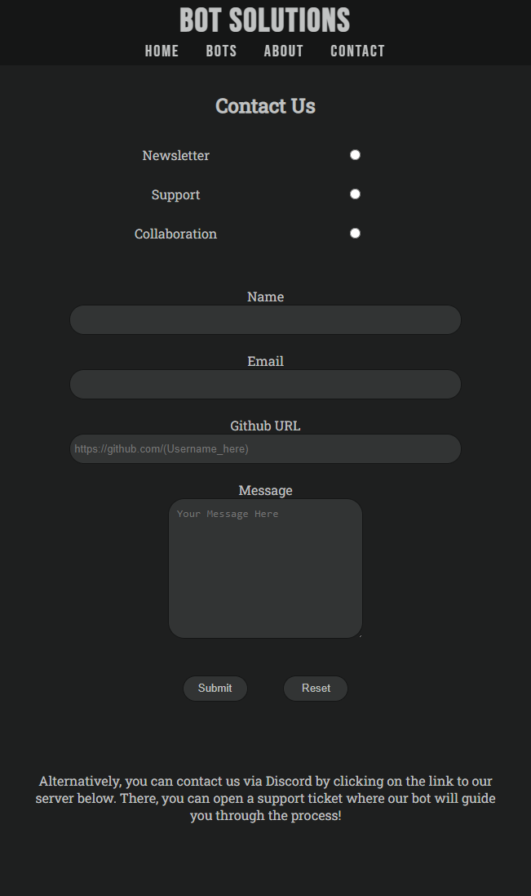

# **Bot Solutions**

   

You can see the live website [here](https://browne878.github.io/HTML-CSS-Portfolio-Project/).

The purpose of this website is to advertise Discord bots. It does this by giving explanations to what each bot does and gives some insight to why each bot was developed.

My aim with this website was to use a similar colour scheme to discord to match where the bots will be used. I also wanted to make the website easy to navigate and not overwhelm the user with information. I wanted to keep all the information concise but make more detail easily availible to the user if the require it.

## **Table of Contents**
- ### [Features](https://github.com/browne878/HTML-CSS-Portfolio-Project#features-1)
    - [Navigation](https://github.com/browne878/HTML-CSS-Portfolio-Project#navigation)
    - [Footer](https://github.com/browne878/HTML-CSS-Portfolio-Project#footer)
    - [Home Page](https://github.com/browne878/HTML-CSS-Portfolio-Project#home-page---indexhtml)
    - [Bot Page](https://github.com/browne878/HTML-CSS-Portfolio-Project#bots-page---botshtml)
    - [About Page](https://github.com/browne878/HTML-CSS-Portfolio-Project#about-page---abouthtml)
    - [Contact Page](https://github.com/browne878/HTML-CSS-Portfolio-Project#contact-page---contacthtml)

- ### [Future Development](https://github.com/browne878/HTML-CSS-Portfolio-Project#future-development-1)

- ### [Testing](https://github.com/browne878/HTML-CSS-Portfolio-Project#testing-1)
    - [Lighthouse](https://github.com/browne878/HTML-CSS-Portfolio-Project#lighthouse)
    - [HTML Validator](https://github.com/browne878/HTML-CSS-Portfolio-Project#html-validator)
    - [CSS Validator](https://github.com/browne878/HTML-CSS-Portfolio-Project#css-validator)

- ### [Bugs](https://github.com/browne878/HTML-CSS-Portfolio-Project#bugs-1)
    - [Bots Page](https://github.com/browne878/HTML-CSS-Portfolio-Project#bots-page)

- ### [Deployment](https://github.com/browne878/HTML-CSS-Portfolio-Project#deployment-1)
    - [Cloning/Forking Repository](https://github.com/browne878/HTML-CSS-Portfolio-Project#cloning--forking-repository)
    - [Local Deployment](https://github.com/browne878/HTML-CSS-Portfolio-Project#local-deployment)
    - [Remote Deployment](https://github.com/browne878/HTML-CSS-Portfolio-Project#remote-deployment)

- ### [Credits](https://github.com/browne878/HTML-CSS-Portfolio-Project#credits-1)

## **Features**

- ### **Navigation**

    - This is a simple header which contains the site name and the Navigation for the website. It remains visible and always on top throughout the website to allow the user to have easy navigation.
    - It remains consistant on each page to prevent any major changes in style and theme throughout the website.

    

- ### **Footer**

    - The footer is styled to be clean and not distract the user from the content of the site.
    - It contains 3 social media icons that link to our pages on those platforms.
    - The style remains consistant on each page to prevent any changes in theme throughout the website.

    

- ### **Home Page - [index.html](https://github.com/browne878/HTML-CSS-Portfolio-Project/blob/Main/index.html)**

    - Site Brief Section

        - This section is the first thing someone will see when visiting the site. For this reason it is intended to be eye catching and give the user an idea of what this site is for.
        - The brief tile has a short few sentences intended to catch the attention of someone visiting the site.

        

    - Why we do it Section

        - This section is intended to give someone an idea of why we develop discord bots and make them want to look further into what we do.
        - Each point is kept short to make the user want to go and find out more information and explore the website.

        

    - Bot Showcase Section

        - This section is to show off some of our previous projects and give the user some key information about them.
        - This section is kept very breif to incourage the user to want to get more information and explore the site.

        

- ### **Bots Page - [bots.html](https://github.com/browne878/HTML-CSS-Portfolio-Project/blob/Main/bots.html)**

    - Support Bot Section

        - This section is to provide an overview of the Support Bot and allow the user to access additional information if they require it.

        - Support Bot More Info

            - This is to give people all the information about the bot if they require it.
            - On smaller screen sizes this is hidden behind a button so that it doesn't overwhelm anyone with too much information they are not interested in.

        

    - Rcon Bot Section

        - This section provides an overview of what the RCON Bot is and allow further information to be gotten easily.

        - Rcon Bot More Info
            - This is to give all of the information about what the RCON bot is and what it can do.
            - On smaller screen sizes this is hidden so that there isn't too much information shown all at once.

        
    
    - Event Bot Section

        - This section is to provide information about what the Event Bot is and what it does.

        - Event Bot More Info
            - This section allows the user to access more detailed information about what the Event Bot can do.
            - This section is hidden on smaller screen sizes in order to keep the website clean and easy to read.

        

- ### **About Page - [about.html](https://github.com/browne878/HTML-CSS-Portfolio-Project/blob/Main/about.html)**

    - Who are we Section

        - We like to be open about who we are. This section of our website focuses on this to give people an idea. This will help gain the trust of people who either wish to use one of our bots or wish to collaborate with us.

        

    - What we do Section

        - This is an explanation to people about what exactly our team does. This is to give people an idea on what we do and what we don't do.

        

    - Why we do it Section

        - This section is to give people context to why we spend our free time making discord bots. By being transparent we believe that it will help people trust what we do.

        

- ### **Contact Page - [contact.html](https://github.com/browne878/HTML-CSS-Portfolio-Project/blob/Main/contact.html)**

    - This form allows the user to reach out to us for multiple reasons. These are:
        - For a Newsletter
        - For Support
        - To Work with us

    - This is a simple contact form that only requests information that is required. It can allow the user to get any help they need, stay up to date on out projects and ask to collaborate.

    

## **Future Development**

- Burger Menu
        - I plan to add a burger menu for navigation on smaller screen sizes at a later date. I believe this will make the header look a lot better on smaller screen sizes and make it easy on touch screens.

- Side Navigation for Bots Page
        - As the number of bots increases I plan to change the bots page to have a navigation element on the left side of the screen. This will allow the user to navigate the list of bots for information easily.
        - I did not impliment this feature now as I do not think that we have enough bots to justify it. It would leave the page feeling empty and the extra navigation would take up more space than needed.

- Live Chat for Support Issues
        - I would like to add this feature directly into the website in the future as I believe it would make reaching out to the team a lot easier for the user. It would prevent us from having to direct the user away from the website for live support.

## **Testing**

### Lighthouse
- I began by using generating a Lighthouse report for each page of the website for mobile and desktop. This allowed me to identify that the background images I was using were too big. To resolve this, I cut them down to 1920x1080 which is a more reasonable size to work.

### HTML Validator
- Once the website was completed, I entered each page into the [W3C Markup Validation Service](https://validator.w3.org/). The results from each can be found in the following locations:
    - Home Page ([index.html](assets/images/images-readme/html-checker-index.png))
    - Bots Page ([bots.html](assets/images/images-readme/html-checker-bots.png))
    - About Page ([about.html](assets/images/images-readme/html-checker-about.png))
    - Contact Page ([contact.html](assets/images/images-readme/html-checker-contact.png))

### CSS Validator
- Once I completed the website, I entered the CSS file into [W3C CSS Validation Service](https://jigsaw.w3.org/css-validator/). The results from the CSS file can be found [here](assets/images/images-readme/css-validator.png).
    - There were no errors found in the validation however, there were warnings related to browser specific extensions that can be ignored.

## **Bugs**

### Bots Page
There is 1 known bug on the Bots Page. This bug occurs once you open and close one of the Bot Modals and then increase the screen size to greater than 1100px wide. The modal closed will not appear after adjusting the screen size.


## **Deployment**

### Cloning / Forking Repository

In order to Fork the Repository, please follow the instructions below.
 1. Navigage to [this](https://github.com/browne878/HTML-CSS-Portfolio-Project) repository.
 2. Next, in the top left of the page, click the fork button.
 3. If you are a member of a team, you may need to choose where to Fork the repository too.

Once you have forked the Repository, you can then clone it to your local machine. To do so, please follow the instructions below.
 1. Navigate to your Forked repository.
 2. Click the green Code button above the repositories files.
 3. Copy the URL in the dropdown window.
 4. Next, open command prompt.
 5. After this, navigate to the directory you would like to clone the repository too with the following command.
 ```
cd <clone location>
 ```
 6. Then, run the following command.
 ```
git clone <URL>
 ```

You have now forked and cloned the repository.

### Local Deployment

These instructions will tell you how to deploy the repository on your local machine with VSCode and the extension [Live Server](https://marketplace.visualstudio.com/items?itemName=ritwickdey.LiveServer). Please ensure you have VSCode and the Live Server extension installed before beginning the following steps.

1. First, follow the steps for Cloning and Forking the repository so you have the repository locally.
2. Open the folder with VSCode by doing one of the following:
    - Right click the file and click `Open with Code`
    - Open command prompt, navigate inside the directiory and run the command `code .`
    - Open VSCode, click file, open folder and then navigate to the repository folder and open it.
3. Next, at the very bottom of the window, there will be a button that says `Go Live`. Click this button and it will deploy it locally and open it in your default browser for you to view.

### Remote Deployment

I deployed this website using GitHub Pages. The steps I took to do this are as follows.

1. Start by navigating to the GitHub repository.
2. Next, towards the top of the page, navigate to the `Settings` tab.
3. After this, on the menu of the left of the page, click on the `Pages` tab.
4. Now, click the `Branch` dropdown menu and select `Main` or whatever the name of your main branch is.
5. Finally, wait for the site to be published. This can take a few moments. The link will be shown at the top of the page.

The link to my published website is: https://browne878.github.io/HTML-CSS-Portfolio-Project/

## **Credits**

- [Matrix Background](assets/images/matrix-background.jpg) downloaded from [Pexels](https://www.pexels.com/photo/close-up-photo-of-matrix-background-1089438/)
- [Code Background](assets/images/code-background.jpg) downloaded from [Pexels](https://www.pexels.com/photo/computer-program-language-text-614117/)
- These Bot Icons ([Bot](assets/images/bot-white.png), [Support](assets/images/support-white.png), [Rcon](assets/images/rcon-white.png), [Event](assets/images/event-white.png)) were designed and made by little_brain#6439 on Discord.
