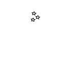

# **Bot Solutions**

   

You can see the live website [here](https://browne878.github.io/HTML-CSS-Portfolio-Project/).

The purpose of this website is to advertise Discord bots. It does this by giving explanations to what each bot does and gives some insight to why each bot was developed.

My aim with this website was to use a similar colour scheme to discord to match where the bots will be used. I also wanted to make the website easy to navigate and not overwhelm the user with information. I wanted to keep all the information concise but make more detail easily availible to the user if the require it.

## **Table of Contents**
- ### [Features](https://github.com/browne878/HTML-CSS-Portfolio-Project#features)
    - [Navigation](https://github.com/browne878/HTML-CSS-Portfolio-Project#navigation)
    - [Footer](https://github.com/browne878/HTML-CSS-Portfolio-Project#footer)
    - [Home Page](https://github.com/browne878/HTML-CSS-Portfolio-Project#home-page---indexhtml)
    - [Bot Page](https://github.com/browne878/HTML-CSS-Portfolio-Project#bots-page---botshtml)
    - [About Page](https://github.com/browne878/HTML-CSS-Portfolio-Project#about-page---abouthtml)
    - [Contact Page](https://github.com/browne878/HTML-CSS-Portfolio-Project#contact-page---contacthtml)

- ### [Future Development](https://github.com/browne878/HTML-CSS-Portfolio-Project#future-development)
    - sub future development

- ### [Testing](https://github.com/browne878/HTML-CSS-Portfolio-Project#testing)
    - sub testing

- ### [Bugs](https://github.com/browne878/HTML-CSS-Portfolio-Project#bugs)
    - sub bugs

- ### [Deployment](https://github.com/browne878/HTML-CSS-Portfolio-Project#deployment)
    - sub deployment

- ### [Credits](https://github.com/browne878/HTML-CSS-Portfolio-Project#credits)
    - sub credits

## **Features**

- ### **Navigation**

- ### **Footer**

- ### **Home Page - [index.html](https://github.com/browne878/HTML-CSS-Portfolio-Project/blob/Main/index.html)**

    - Site Brief Section

    - Why we do it Section

    - Bot Showcase Section

- ### **Bots Page - [bots.html](https://github.com/browne878/HTML-CSS-Portfolio-Project/blob/Main/bots.html)**

    - Support Bot Section

        - Support Bot More Info

    - Rcon Bot Section

        - Rcon Bot More Info
    
    - Event Bot Section

        - Event Bot More Info

- ### **About Page - [about.html](https://github.com/browne878/HTML-CSS-Portfolio-Project/blob/Main/about.html)**

    - Who are we Section

    - What we do Section

    - Why we do it Section

- ### **Contact Page - [contact.html](https://github.com/browne878/HTML-CSS-Portfolio-Project/blob/Main/contact.html)**

## **Future Development**

## **Testing**

## **Bugs**

## **Deployment**

## **Credits**
